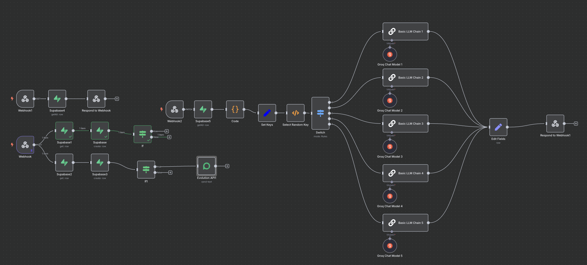

# 🌱 Planta da Xuda

**Planta da Xuda** é um projeto de IoT divertido e educativo que "ensina a planta a falar"!  
Utilizando um **ESP32** com sensores de umidade do solo, a planta monitora seu próprio estado e envia mensagens via internet — como se estivesse realmente pedindo água ou agradecendo o cuidado! 💬🪴

---

## 💡 O que o projeto faz?

- Lê a umidade de duas plantas: **Juju** e **Tetinha**
- Armazena localmente as leituras a cada 5 minutos
- A cada hora (exceto de madrugada), ativa o Wi-Fi e envia os dados via HTTP para um webhook no **n8n**
- As plantas analisam os dados e "falam" como se fossem reais — com emoção! 😢🌿💧
- Possui modo de teste com dados aleatórios para simulações

---

## ⚙️ Tecnologias utilizadas

- 🧠 **ESP32 + MicroPython**
- 🌡️ **Sensores de umidade capacitiva**
- 🔄 **n8n** para automações e webhooks
- 🗃️ **Supabase** para armazenar dados históricos
- 🤖 **OpenAI (opcional)** para gerar respostas personalizadas com personalidade das plantas
- 🔋 **Deep Sleep** para economia de energia
- 🌐 **Sincronização de hora com NTP (ajustado para UTC-3)**

---

## 🔧 Funcionalidades principais

- Leitura precisa de umidade do solo
- Conexão Wi-Fi controlada e eficiente
- Envio de dados para servidor com webhook HTTP
- Mensagens personalizadas baseadas nos dados
- Personalidades diferentes para cada planta 🌸

---

## 🎯 Ideal para:

- Projetos educacionais e oficinas maker
- Monitoramento de plantas em casa ou escola
- Demonstração de integração entre sensores físicos e IA
- Aprender IoT de forma divertida e criativa

---

## 📸 Exemplo de resposta

> Olá! Eu sou a **Tetinha**! 🌱  
> Minha umidade está em 290... estou com sede! 😢  
> Me dá uma molhadinha, por favor! 💦

---

## Fluxo N8N


## SQL do Supabase
```SQL
-- Cria a tabela de plantas
create table public.plantas (
  id uuid primary key default gen_random_uuid(),
  nome text not null
);

-- Cria a tabela de logs de umidade
create table public.logs (
  id uuid primary key default gen_random_uuid(),
  planta_id uuid references public.plantas(id) on delete cascade,
  umidade numeric not null,
  hora timestamp with time zone default now()
);

create or replace view public.logs_com_plantas as
select
  logs.id as log_id,
  logs.planta_id,
  plantas.nome as nome_planta,
  logs.umidade,
  logs.hora
from
  logs 
  JOIN plantas ON logs.planta_id = plantas.id
ORDER BY hora DESC
LIMIT 50;

```

---
## 📁 Em breve:

- Gráfico histórico por planta com frontend web
- Notificações via Telegram ou WhatsApp
- Dashboard com status em tempo real

---

Feito com ❤️ por quem acredita que até as plantas merecem voz.